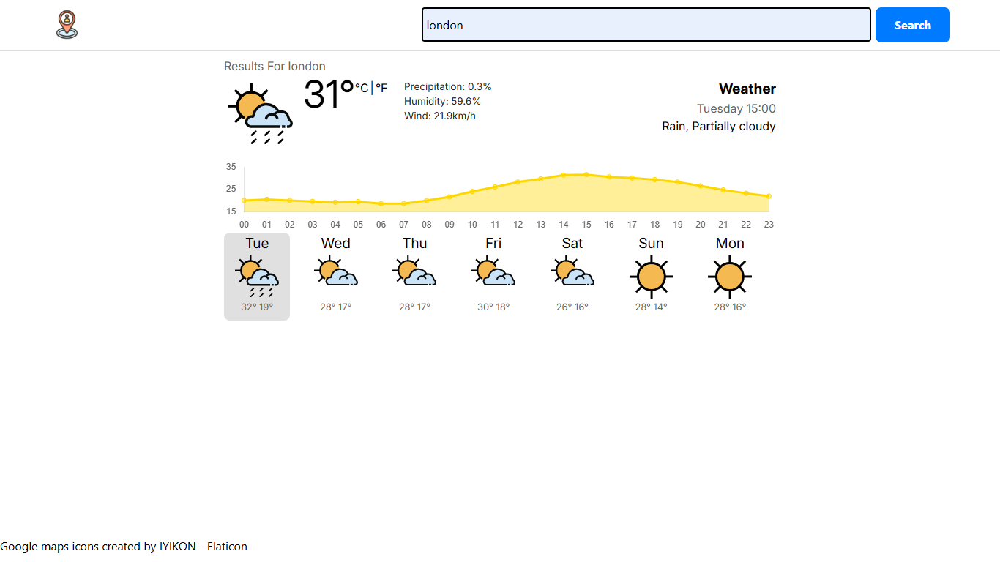

# Weatheria

Weatheria is a responsive weather application that allows users to check real-time weather data for their current location or any searched city. It provides a clean interface, and offers hourly and daily forecasts visualized with interactive charts.

## Features

- **Current Weather** – Displays temperature, humidity, wind speed, and conditions.
- **Search by City** – Fetch weather data for any location using the search bar.
- **Geolocation Support** – Detects and displays weather for the user's current location.
- **Hourly Forecast** – View upcoming temperature trends in an interactive chart.
- **Daily Forecast** – See extended weather predictions for the next several days.
- **Responsive Design** – Optimized for desktop, tablet, and mobile devices.
- **Error Handling** – Provides user-friendly error messages for invalid city names or connection issues.
- **Loading Indicators** – Shows progress while fetching data.

## Screenshots

1. ### Weather data for a searched city
   
2. ### Weather data for current position
    
3. ### Weather Data for near future
   
4. ### Error Screen
          

## Concepts Learned & Practiced

During the development of Weatheria, the following concepts were explored and implemented:

- **Promises** – Handling asynchronous operations when fetching weather data.
- **Asynchronous Programming (async/await)** – Writing clean, readable asynchronous code.
- **Class Constructors** – Structuring and organizing weather data into reusable models.
- **Factory Functions** – Creating modular, reusable functions to handle repetitive tasks.
- **Dynamic Module Imports** – Loading resources like weather icons only when needed.
- **API Integration** – Fetching and parsing JSON data from the Visual Crossing Weather API.
- **Responsive Web Design** – Ensuring usability across different device sizes.
- **Chart.js Data Visualization** – Plotting temperature data in line graphs.
- **Error & State Management** – Handling API failures, loading states, and UI updates.


## Installation

1. **Clone the repository**

   ```bash
   git clone https://github.com/your-username/Weatheria.git

   ```

2. **Navigate into the Project Directory**

   ```bash
   cd Weatheria

   ```

3. **Install Dependencies**
   ```bash
   npm install
   ```
4. **Start the development server**
   ```bash
   npm run dev
   ```

## Usage

1. Open the application in your browser at the provided local server address.

2. View current weather for your location (if location permissions are granted).

3. Use the search bar to check weather for other cities.

4. Explore hourly and daily forecasts using the chart view.

## Attribution

This project uses the following external resources:

- [Visual Crossing Weather API](https://www.visualcrossing.com/) – Weather data provider.  
- [Chart.js](https://www.chartjs.org/) – For rendering interactive weather charts.  
- [Flaticon](https://www.flaticon.com/) – Weather icons used in the UI.  
- [Google Fonts](https://fonts.google.com/) – For typography styling.  
